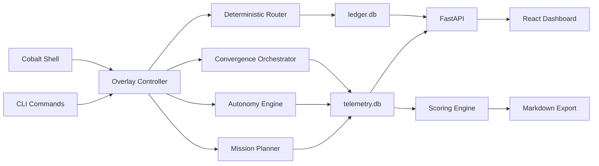

# OpenCobalt

[](https://github.com/moderqtor/OpenCobalt/actions/workflows/ci.yml)
[](https://www.python.org/)
[](LICENSE)

Agents come and go. Models change. Sessions die. OpenCobalt remembers.

OpenCobalt is local-first infrastructure that turns ephemeral AI-agent work into durable, verified mission memory.

OpenCobalt converts ephemeral agent work into durable mission intelligence.

OpenCobalt lets AI coding sessions remember what happened, so a fresh agent can pick up where the last one stopped.

The current wedge is cold resume: OpenCobalt can ingest an old agent report, extract structured mission state, verify it, and generate a handoff packet so a fresh agent can continue without the original chat history.

OpenCobalt does not train models or replace coding agents. It operates at inference time as a local mission memory and handoff layer: extracting structured state from agent reports, verifying it against source output, and generating target-specific continuation packets for future agents.

## Cold Resume Demo

Run the deterministic local demo:

```bash
opencobalt demo cold-resume --target codex-cli
```

Other handoff targets:

```bash
opencobalt demo cold-resume --target generic
opencobalt demo cold-resume --target claude-code
opencobalt demo cold-resume --target cursor
```

The demo prints a mission id, extraction id, verification id, safety checks, a cold-resume command, and a handoff command. A typical run shows:

- `Created mission: mis-...`
- `Attached extraction: mex-...`
- `Verified extraction: mver-...`
- `opencobalt continue MISSION_ID`
- `opencobalt handoff MISSION_ID --to codex-cli`

This proves local durable mission memory, deterministic extraction, verification, warning visibility, and copy-paste handoff generation. Mission state is useful continuity context, not unquestionable truth.

This demo does not call a live model, launch an agent, or grant authority. It demonstrates local durable memory, verification, and handoff.

It also does not train models, improve model weights, execute repository changes, create execution receipts, or grant permission to push, merge, deploy, publish, spend, message, touch secrets, or perform irreversible actions.

For daily closeout from a real finished agent report:

```bash
opencobalt missions close-session MISSION_ID --file report.txt --verify --handoff-to codex-cli
```

This uses the same local extraction, verification, and handoff paths. Mission state is continuity context, not unquestionable truth.

Deeper demo material:

- [Cold resume demo guide](docs/COLD_RESUME_DEMO.md)
- [Cold resume video script](docs/COLD_RESUME_VIDEO_SCRIPT.md)
- [Sanitized terminal transcript](docs/assets/cold-resume-demo-transcript.txt)
- [Expected output guide](docs/assets/cold-resume-demo-output.md)
- [Recording checklist](docs/assets/cold-resume-recording-checklist.md)

Beyond cold resume, OpenCobalt is a local-first control and provenance layer for AI work. It routes across agent runtimes, records verifiable work receipts, preserves project memory, and enforces policy across tools such as Google Antigravity CLI, Claude Code, Codex, Aider, and Ollama.

It is not a chatbot, hosted service, or API proxy. The default configuration makes no API calls. Ollama and external CLI tools are optional and degrade gracefully when unavailable. OpenCobalt supports routing, diagnostics, audit logging, integration discovery, and receipt-backed execution: policy-gated one-shot runs that capture output, hash artifacts, and write verifiable work receipts (see `docs/EXECUTION_LAYER.md`).

## What It Does

- Routes tasks deterministically with reproducible keyword scoring.
- Executes one-shot runtime tasks behind a policy gate and writes verifiable receipts with SHA-256 hashed output artifacts.
- Stores route decisions, session events, verification results, memories, and telemetry in local SQLite databases.
- Runs local shell workflows for routing, orchestration, convergence checks, autonomous task queues, mission planning, and context briefs.
- Scores completed runs across output quality, adherence, latency, token efficiency, tool fit, decomposition, agent selection, and convergence quality.
- Exports ledger and scored telemetry runs to markdown for project notes.
- Provides a React and FastAPI dashboard plus a Tauri desktop wrapper.

## Quickstart

```bash
git clone https://github.com/moderqtor/OpenCobalt
cd OpenCobalt
pip install -e ".[dev,server]"

opencobalt status
opencobalt route "review this module and write focused tests"
opencobalt
```

Ollama is optional. If it is installed, OpenCobalt can use it for worker-tier summarization and telemetry judging. Without Ollama, routing and telemetry fallback scoring still work locally.

## Core Commands

```bash
opencobalt run "hello" --runtime noop --execute # receipt-backed execution (dry-run by default)
opencobalt receipts list                        # verifiable work receipts
opencobalt artifacts verify <id>                # recompute artifact hashes
opencobalt route "design the auth module"       # deterministic tool routing
opencobalt history --limit 20                   # recent route decisions
opencobalt stats                                # ledger analytics
opencobalt verify                               # pytest plus public-check
opencobalt public-check                         # pre-push safety scan
opencobalt doctor antigravity                   # inspect local agy runtime
opencobalt context                              # build a context pack
opencobalt brief                                # session brief for handoff
opencobalt ui                                   # dashboard at localhost:5173
opencobalt desktop                              # Tauri desktop wrapper
```

## Shell Workflow

Run `opencobalt` with no arguments to enter the interactive shell.

```text
opencobalt › /route design the auth module
opencobalt › /orch implement the API, tests, and docs
opencobalt › /converge build auth with tests and docs
opencobalt › /auto finish the dashboard polish --hours 2
opencobalt › /telemetry status
```

The shell keeps slash commands discoverable, routes plain prompts through the overlay controller, and shows session status in the prompt toolbar.

## Telemetry

Phase 15 adds a local intelligence layer in `.opencobalt/telemetry.db`.

```bash
opencobalt telemetry status
opencobalt telemetry runs --limit 20
opencobalt telemetry show <run_id>
opencobalt telemetry scores
opencobalt telemetry score <run_id>
opencobalt telemetry export --output ./telemetry-notes
opencobalt benchmark status --telemetry
```

Telemetry captures run type, prompt, agent, model, tool events, skills, connectors, artifacts, retries, latency, raw output, summary, and a ten-category score. Ollama judging is optional. If Ollama is unavailable or slow, OpenCobalt uses bounded heuristic fallback scoring.

## Architecture



SQLite is the source of truth:

- `.opencobalt/ledger.db` for sessions, route decisions, events, verification, costs, and benchmark records.
- `.opencobalt/memories.db` for bridge memory.
- `.opencobalt/observability.db` for observability sessions.
- `.opencobalt/telemetry.db` for scored run telemetry.

No Postgres, Redis, vector database, or background daemon is required for core state.

## Tool Tiers

| Tier | Tools | Typical work |
|---|---|---|
| executive | Google Antigravity CLI, Claude Code | Agent-runtime workflows, architecture, security review, final code, public docs |
| manager | Codex CLI, Cursor, Context7, GitHub CLI | Tests, lint, cleanup, UI work, PR and issue workflows |
| worker | Ollama, aider | Summaries, tags, extraction, local fallback |

Ollama is worker-tier only and optional.

Gemini CLI integration is deprecated. OpenCobalt now treats Google Antigravity CLI (`agy`) as the canonical Google agent runtime. Existing Gemini CLI config aliases remain supported temporarily and resolve to `google-antigravity` with a deprecation warning. Gemini remains a valid model-family name.

## Dashboard

`opencobalt ui` starts:

- FastAPI backend on `localhost:8000`
- Vite dashboard on `localhost:5173`

The dashboard includes command routing, agents, telemetry scores, routing graph, ledger timeline, benchmarks, integrations, context pack, verification receipts, and DesignLab notes. Views are hash-linkable, for example `http://localhost:5173/#telemetry`.

## Verification

The repository test suite covers routing, ledger, memory, cost control, shell, telemetry, API, dashboard data, convergence, autonomy, and safety checks.

Common local checks:

```bash
python3 -m pytest -q
ruff check src/ tests/
npm run build --prefix ui
opencobalt public-check
opencobalt doctor
```

CI runs on GitHub Actions with Python 3.11.

## Project Layout

```text
src/opencobalt/
  cli.py                     Typer command surface
  shell.py                   interactive shell
  api_server.py              FastAPI dashboard backend
  core/
    router.py                deterministic routing
    ledger.py                SQLite ledger
    telemetry.py             run telemetry schema and session API
    scoring_engine.py        heuristic and judge-backed scoring
    ollama_judge.py          optional Ollama scoring adapter
    markdown_exporter.py     scored run markdown export
    convergence_orchestrator.py
    autonomy_engine.py
    mission.py
    public_safety.py
  agents/
  skills/
  integrations/
    antigravity_integration.py Google Antigravity CLI discovery
ui/
  src/App.jsx                React dashboard
  src/RoutingGraph.jsx       routing visualization
  src-tauri/                 desktop wrapper
tests/
docs/
```

## Safety Model

- No API calls by default.
- No required cloud database or hosted service.
- No 24/7 daemon for core workflows.
- Public safety scan checks for `.env` files, secret patterns, private path references, and oversized artifacts.
- API adapters require explicit configuration with `opencobalt config set api_enabled true`.
- Agent runtimes with terminal, browser, and file access are powerful but risky. OpenCobalt adds visibility, receipts, policy metadata, and approval boundaries around them.

## License

MIT. See [LICENSE](LICENSE).
