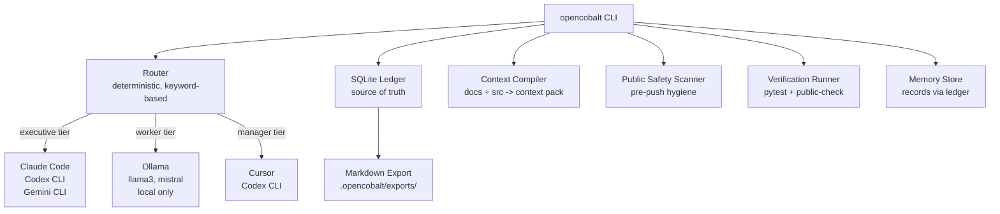

# OpenCobalt

**Local-first AI orchestration and memory control plane.**

OpenCobalt routes work across coding agents, local models, session logs, project context, and verification workflows. It is not a chatbot. It is not a generic AI assistant wrapper. It is a control plane that coordinates AI tools you already use.

---

## What It Does

- Routes tasks to the right tool (Claude Code, Codex CLI, Gemini CLI, Cursor, Ollama) based on task type, risk level, and tier
- Maintains a durable SQLite ledger of sessions, tool runs, route decisions, and verification results
- Compiles context packs from project docs and source files for agent consumption
- Scans for public-safety issues before any push: secrets, private paths, oversized artifacts
- Runs verification pipelines and records results

---

## Architecture



Ollama models are **worker-tier only**: summarization, tagging, extraction, rough drafts. Serious decisions (architecture, security, public docs) route to executive-tier tools only.

---

## Install

```bash
git clone https://github.com/moderqtor/OpenCobalt
cd OpenCobalt
pip install -e ".[dev]"
```

Requires Python 3.11+. Ollama is optional (local model commands degrade gracefully without it).

---

## CLI

```bash
# System status: Python, Ollama, ledger, docs, safety scan
opencobalt status

# List installed Ollama models
opencobalt models

# Route a task to the right tool
opencobalt route "design the event spine architecture"
opencobalt route "summarize this log file"

# Write a session event to the ledger
opencobalt log --summary "reviewed auth module"

# Memory
opencobalt memory status
opencobalt memory export --project opencobalt

# Build a context pack from docs + src
opencobalt context

# Run tests + public safety scan, record results
opencobalt verify

# Pre-push hygiene scan
opencobalt public-check

# Full health check
opencobalt doctor

# Live terminal dashboard
opencobalt tui
```

---

## What Works Today

- CLI with all commands above, including a live terminal dashboard (`opencobalt tui`)
- Deterministic task router (keyword-based, no LLM calls) with full score table output
- SQLite ledger: events, verification results, route decisions, memory records
- Ollama model discovery with graceful fallback
- Context pack compiler
- Public safety scanner: .env detection, secret patterns, oversized files, private vault paths
- 58 passing tests

---

## What Is Experimental

- Cost control module (stub -- not yet wired to API adapters)
- DesignLab / Visual Compiler (documented, not yet implemented)
- UI layer (planned -- see docs/DESIGN_SYSTEM.md and docs/DESIGNLAB.md)
- Obsidian markdown export mirror (schema exists, Obsidian write path not wired)

---

## Limitations

- No API calls by default. All routing is deterministic and local.
- Optional API adapters (Anthropic, OpenAI, Google) require explicit configuration in `.env`.
- Ollama must be running separately for local model commands. OpenCobalt does not launch Ollama.
- The router is keyword-based. It does not infer task semantics.
- No persistent agent execution. OpenCobalt routes and logs -- it does not run agents autonomously.

---

## Demo

```
$ opencobalt status

  OPENCOBALT  control plane · 2026-05-29 13:45

  System
  ──────────────────────────────────────────
  ●  python      3.11.9
  ●  repo        ~/dev/OpenCobalt

  Models
  ──────────────────────────────────────────
  ●  ollama         available (worker-tier)
  ●  llama3:latest  4.7 GB
  ●  mistral:latest 4.4 GB

  Ledger
  ──────────────────────────────────────────
  ●  database    5 events  ·  .opencobalt/ledger.db
  ●  memory      2 records

  Docs
  ──────────────────────────────────────────
  ●  README.md   present
  ●  docs/       present
  ●  context     .opencobalt/context/latest.md

  Safety
  ──────────────────────────────────────────
  ●  scan        clean

  ████████████████████████████████  11/11 healthy
```

```
$ opencobalt route "refactor this Python CLI and verify tests"

  Routing: "refactor this Python CLI and verify tests"

   Tool            Tier          Score
  ───────────────────────────────────────────────────
   codex-cli       manager          81   recommended
   claude-code     executive        78
   gemini-cli      executive        60
   cursor          manager          60
   ollama          worker           40

  Routed to codex-cli (score 81). Matched keywords: test, verify. Tier: manager. Runner-up: claude-code (score 78).
```

```
$ opencobalt route "summarize this log file"

  Routing: "summarize this log file"

   Tool            Tier          Score
  ───────────────────────────────────────────────────
   ollama          worker           78   recommended
   claude-code     executive        50
   codex-cli       manager          45
   gemini-cli      executive        40
   cursor          manager          40

  Routed to ollama (score 78). Matched keywords: summarize. Tier: worker. Runner-up: claude-code (score 50).
```

```
$ opencobalt context

  Context pack written  .opencobalt/context/latest.md
  files          :  16
  token estimate :  ~16,219
```

```
$ opencobalt verify

  PASS  pytest: 58 passed in 0.12s
  PASS  public-check: No public-safety issues detected.

  All checks passed.
```

---

## Screenshots

`opencobalt status` -- system health with grouped categories and health bar:


`opencobalt route` -- full score table across all tools:


Status with public safety scan output:


---

## Credits

See [CREDITS.md](CREDITS.md) for libraries and research projects that informed this work.

---

## License

MIT. See [LICENSE](LICENSE).
