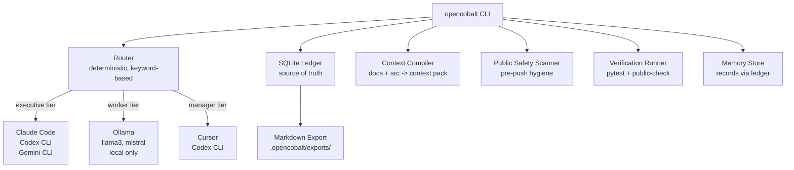

# OpenCobalt

[](https://github.com/moderqtor/OpenCobalt/actions/workflows/ci.yml)
[](https://www.python.org/)
[](LICENSE)

**Local-first AI orchestration and memory control plane.**

OpenCobalt routes work across coding agents, local models, session logs, project context, and verification workflows. It is not a chatbot. It is not a generic AI assistant wrapper. It is a control plane that coordinates AI tools you already use.

---

## Status

| Component | State |
|---|---|
| CLI routing | Functional |
| SQLite session ledger | Functional |
| Pydantic v2 schemas | Functional |
| pytest / ruff / CI | Passing (214 tests, verified 2026-06-01) |
| Memory bridge (mem0) | Wired, mem0 optional install required |
| Agent observability | SQLite-backed, local only |
| UI | Scaffold only — backend not wired |
| API adapters (OpenAI, Anthropic) | Planned, not active by default |
| Khoj integration | Docker sidecar setup docs ready, not started |
| Persistent agent execution | Not implemented |

---

## Why I built this

I kept switching between Claude Code, Codex, Gemini CLI, and Cursor and losing context
every time. Each tool had its own idea of what was happening. I started logging sessions
manually to track cost and what was actually running, and it got tedious, so I built the
ledger first. The routing layer came later when I noticed I was sending summarization tasks
to Claude Opus for no reason. The first version was too ambitious — I had plans for vector
memory and a neural router. I cut it down to deterministic keyword scoring and SQLite, and
it was more useful. Most of what's here came from actual frustration.

---

## What It Does

- Routes tasks to the right tool (Claude Code, Codex CLI, Gemini CLI, Cursor, Ollama) based on task type, risk level, and tier
- Maintains a durable SQLite ledger of sessions, tool runs, route decisions, and verification results
- Compiles context packs from project docs and source files for agent consumption
- Scans for public-safety issues before any push: secrets, private paths, oversized artifacts
- Runs verification pipelines and records results

---

## Why Not a Wrapper?

- **Deterministic routing.** No LLM calls are made to decide which tool handles a task. Routing is keyword-scored and fully reproducible without API cost.
- **Durable SQLite ledger.** Session state is written to disk immediately. It does not vanish when the process exits and can be inspected with any SQLite browser.
- **Tiered model discipline.** Ollama handles cheap, local tasks (summarization, tagging, extraction). Architecture, security, and public-facing decisions route to executive-tier tools only.
- **Public safety enforcement.** Every push path runs a scanner that catches secrets, private vault paths, and oversized artifacts before they leave the machine.
- **Explicit opt-in for APIs.** No API adapter activates unless configured in `.env`. All defaults are local and offline.
- **Modular registry pattern.** Agents, skills, and integrations register into a slot system. Adding a new tool does not require editing core logic.

---

## Architecture



Ollama models are **worker-tier only**: summarization, tagging, extraction, rough drafts. Serious decisions (architecture, security, public docs) route to executive-tier tools only.

The router is deterministic because routing decisions must be reproducible, cost nothing to make, and carry no hallucination risk. A keyword scorer returns the same answer for the same input every time. SQLite is the source of truth because it requires zero infrastructure, the file is portable across machines, and any SQLite browser can inspect or query the ledger without custom tooling. Ollama is restricted to the worker tier to enforce cost discipline: keeping local models out of architecture and security decisions ensures those tasks always go to the highest-quality tools available.

---

## Project Structure

```
src/opencobalt/
  cli.py          CLI entry point
  core/           ledger, router, context, public_safety, cost, models
  agents/         BaseAgent ABC + 4 concrete agents
  skills/         BaseSkill ABC + file-reader, diff-writer
  integrations/   BaseIntegration ABC + aider, ollama stubs
ui/               React + Tailwind dashboard shell (run: cd ui && npm run dev)
tests/            214 tests
.github/          CI workflow (ubuntu-latest, Python 3.11)
docs/             Architecture, design system, integrations, roadmap
```

---

## Install

```bash
git clone https://github.com/moderqtor/OpenCobalt
cd OpenCobalt
pip install -e ".[dev]"
```

Requires Python 3.11+. Ollama is optional (local model commands degrade gracefully without it).

---

## CLI

```bash
# System status: Python, Ollama, ledger, docs, safety scan
opencobalt status

# List installed Ollama models
opencobalt models

# Route a task -- deterministic, no LLM calls, logs to ledger by default
opencobalt route "design the event spine architecture"
opencobalt route "summarize this log file"
opencobalt route "design the auth module" --verbose   # show per-tool keyword matches

# Show routing history from the ledger
opencobalt history
opencobalt history --limit 50

# Ledger analytics: tier breakdown, top tools, recent activity
opencobalt stats

# Route 10 representative tasks and show tier breakdown
opencobalt benchmark

# Write a session event to the ledger
opencobalt log --summary "reviewed auth module"

# Memory
opencobalt memory status
opencobalt memory add "SQLite is the source of truth" --namespace architecture
opencobalt memory export --project opencobalt

# Build a context pack from docs + src
opencobalt context

# Run tests + public safety scan, record results
opencobalt verify

# Export full ledger to a timestamped markdown report
opencobalt export

# Pre-push hygiene scan
opencobalt public-check

# Full health check
opencobalt doctor

# Live terminal dashboard (4 panels: status, routes, events, cost)
opencobalt tui

# Agent system -- 4 agents: summarizer, tagger, code-reviewer, context-builder
opencobalt agents list
opencobalt agents run summarizer "explain the router module"
opencobalt agents run summarizer --dry-run "explain the router module"

# External integrations (aider, ollama)
opencobalt integrations list

# Cost control
opencobalt cost status
opencobalt cost set-mode cheap    # cheap | standard | frontier

# Config
opencobalt config set api_enabled true
opencobalt config get api_enabled
opencobalt config list

# Named work sessions
opencobalt session start "auth-refactor"
opencobalt session show
opencobalt session end

# Lint (ruff check src/ tests/)
opencobalt lint

# Full health check (status + models + extra structural checks)
opencobalt doctor

# UI shell (React + Tailwind, backend not yet wired)
opencobalt ui
```

---

## What Works Today

- CLI with all commands above, including a live terminal dashboard (`opencobalt tui`)
- Deterministic task router (keyword-based, no LLM calls) with full score table output
- SQLite ledger: events, verification results, route decisions, memory records
- Ollama model discovery with graceful fallback
- Context pack compiler
- Public safety scanner: .env detection, secret patterns, oversized files, private vault paths
- Cost control module with per-run and monthly budget caps
- Subagent and skill library system with 4 agents, 2 skills
- External integration registry (aider, ollama stubs)
- CI workflow via GitHub Actions
- UI dashboard shell (React + Tailwind, `cd ui && npm run dev`)
- 214 passing tests (verified 2026-06-01)

---

## What Is Experimental

- Cost control module (stub -- not yet wired to API adapters)
- DesignLab / Visual Compiler (documented, not yet implemented)
- UI layer (planned -- see docs/DESIGN_SYSTEM.md and docs/DESIGNLAB.md)
- Obsidian markdown export mirror (schema exists, Obsidian write path not wired)

---

## Limitations

- No API calls by default. All routing is deterministic and local.
- Optional API adapters (Anthropic, OpenAI, Google) require explicit configuration in `.env`.
- Ollama must be running separately for local model commands. OpenCobalt does not launch Ollama.
- The router is keyword-based. It does not infer task semantics.
- No persistent agent execution. OpenCobalt routes and logs -- it does not run agents autonomously.

---

## Tradeoffs

Deterministic router vs learned routing: current scoring is keyword-based, fast, cheap,
and fully testable. A semantic router would make smarter calls but needs enough logged usage
data to be meaningful, and it would be harder to debug.

SQLite vs cloud DB: correct for a local-first tool. Schema stays the same if the storage
layer ever needs to change.

Ollama worker-tier only: llama3 and mistral handle cheap preprocessing locally, but routing
decisions and architecture work stay on Sonnet or better.

---

## Demo

```
$ opencobalt status

  OPENCOBALT  control plane · 2026-05-29 13:45

  System
  ──────────────────────────────────────────
  ●  python      3.11.9
  ●  repo        ~/dev/OpenCobalt

  Models
  ──────────────────────────────────────────
  ●  ollama         available (worker-tier)
  ●  llama3:latest  4.7 GB
  ●  mistral:latest 4.4 GB

  Ledger
  ──────────────────────────────────────────
  ●  database    5 events  ·  .opencobalt/ledger.db
  ●  memory      2 records

  Docs
  ──────────────────────────────────────────
  ●  README.md   present
  ●  docs/       present
  ●  context     .opencobalt/context/latest.md

  Safety
  ──────────────────────────────────────────
  ●  scan        clean

  ████████████████████████████████  11/11 healthy
```

```
$ opencobalt route "refactor this Python CLI and verify tests"

  Routing: "refactor this Python CLI and verify tests"

   Tool            Tier          Score
  ───────────────────────────────────────────────────
   codex-cli       manager          81   recommended
   claude-code     executive        78
   gemini-cli      executive        60
   cursor          manager          60
   ollama          worker           40

  Routed to codex-cli (score 81). Matched keywords: test, verify. Tier: manager. Runner-up: claude-code (score 78).
```

```
$ opencobalt route "summarize this log file"

  Routing: "summarize this log file"

   Tool            Tier          Score
  ───────────────────────────────────────────────────
   ollama          worker           78   recommended
   claude-code     executive        50
   codex-cli       manager          45
   gemini-cli      executive        40
   cursor          manager          40

  Routed to ollama (score 78). Matched keywords: summarize. Tier: worker. Runner-up: claude-code (score 50).
```

```
$ opencobalt benchmark

  Benchmark  10 tasks

   Task                                      Tool            Tier        Score
  ──────────────────────────────────────────────────────────────────────────────
   design the authentication module arch...  claude-code     executive     94
   summarize this session log                ollama          worker        78
   write unit tests for the router           codex-cli       manager       73
   fix the null pointer exception in ev...   claude-code     executive     78
   tag these meeting notes for the kno...    ollama          worker        78
   analyze all files in the codebase f...    gemini-cli      executive     84
   refactor the context compiler module      claude-code     executive     86
   extract key decisions from this tra...    ollama          worker        78
   review the public safety scanner fo...    claude-code     executive     70
   implement the agent registry API          claude-code     executive     86

  executive: 6  manager: 1  worker: 3
```

```
$ opencobalt agents run code-reviewer src/opencobalt/core/router.py

  code-reviewer  manager tier

  Code review: src/opencobalt/core/router.py
  ============================================================
  File metrics
    lines      : 125
    functions  : 2
    classes    : 0
    comments   : 2
    size       : 4796 bytes

  Finding 1
    Check all public functions have descriptive docstrings.

  Finding 2
    Verify error paths raise or return a typed result rather than returning None silently.

  Escalation note: medium/high findings should be reviewed by an executive-tier
  tool before automated changes are applied.
```

```
$ opencobalt session start "auth-refactor"

  Session started  auth-refactor

$ opencobalt route "design the auth module"

  Routing: "design the auth module"  (session: auth-refactor)

   Tool            Tier       Score
  ──────────────────────────────────────────────────────
   claude-code     executive    86   recommended
   cursor          manager      68

$ opencobalt session show

  Session  auth-refactor
  started:  2026-05-29T14:22
  1 route decision(s) this session

   Time    Tool         Tier       Task
  ─────────────────────────────────────────────────────
   14:22   claude-code  executive  design the auth module
```

```
$ opencobalt verify

  PASS  pytest: 214 passed in 1.09s
  PASS  public-check: No public-safety issues detected.

  All checks passed.
```

---

## Screenshots

`opencobalt status` -- system health with grouped categories and health bar:


`opencobalt route` -- full score table across all tools:


Status with public safety scan output:


---

## Credits

See [CREDITS.md](CREDITS.md) for libraries and research projects that informed this work.

---

## License

MIT. See [LICENSE](LICENSE).
