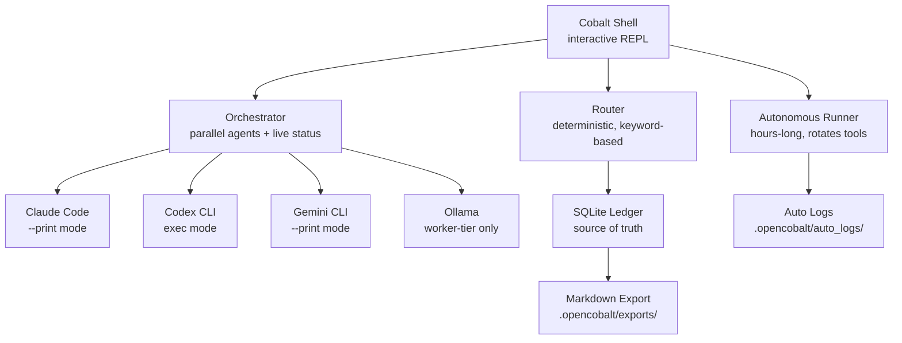

# OpenCobalt

[](https://github.com/moderqtor/OpenCobalt/actions/workflows/ci.yml)
[](https://www.python.org/)
[](LICENSE)

A local-first control plane that coordinates Claude Code, Codex, Gemini CLI, and Ollama. Routes tasks to the right tool, keeps a durable session ledger, runs agents in parallel, and can work autonomously for hours while you're away.

---

## Why I built this

I kept switching between Claude Code, Codex, Gemini CLI, and Cursor and losing context every time. Each tool had its own idea of what was happening. I started logging sessions manually to track cost and what was actually running, and it got tedious, so I built the ledger first.

The routing layer came later when I noticed I was sending summarization tasks to Claude Opus for no reason. The first version was too ambitious -- I had plans for vector memory and a neural router. I cut it down to deterministic keyword scoring and SQLite, and it was more useful. Most of what's here came from actual frustration.

The `/orch` command is the most useful thing here: split a task across all your installed agents, run them in parallel, watch live status, get synthesized output. `/auto` takes it further and runs for hours on its own.

---

## Quickstart

```bash
git clone https://github.com/moderqtor/OpenCobalt
cd OpenCobalt
pip install -e ".[dev]"

# Enter the interactive shell
opencobalt

# Or go straight to a command
opencobalt route "design the auth module"
```

Requires Python 3.11+. Ollama is optional -- local model commands degrade gracefully without it.

---

## The shell

```
$ opencobalt

  OPENCOBALT  control plane

  /route   route a task to the right tool
  /orch    split a task across all agents, run in parallel
  /auto    autonomous multi-hour session (rotates tools)
  /brief   context brief for your current session
  /pipe    chain tasks through a pipeline
  /graph   knowledge graph

> /orch implement a login page with JWT auth

  dispatching to 3 agents...

  ┌──────────────────────────────────────────────────────────┐
  │ auto  iteration 1 · 0:03                                 │
  ├──────────────┬───────────┬──────────┬─────────┬──────────┤
  │ type         │ tool      │ status   │ elapsed │          │
  ├──────────────┼───────────┼──────────┼─────────┼──────────┤
  │ impl         │ claude    │ ✓ done   │   1:12  │          │
  │ tests        │ codex     │ ✓ done   │   0:58  │          │
  │ docs         │ gemini    │ ⟳ running│   0:41  │ ████░░░░ │
  └──────────────┴───────────┴──────────┴─────────┴──────────┘
```

---

## Commands

### Routing

```bash
# Deterministic routing -- no LLM calls, logs to ledger
opencobalt route "design the event spine architecture"
opencobalt route "summarize this log file"
opencobalt route "design the auth module" --verbose   # show keyword matches
opencobalt route "build the API" --exec               # open the winning tool
opencobalt route "build the API" --dry-run            # show what --exec would do
```

```
$ opencobalt route "refactor this Python CLI and verify tests"

  Routing: "refactor this Python CLI and verify tests"

   Tool            Tier          Score
  ─────────────────────────────────────────────────
   codex-cli       manager          81   recommended
   claude-code     executive        78
   gemini-cli      executive        60
   cursor          manager          60
   ollama          worker           40

  Routed to codex-cli (score 81). Tier: manager.
```

### Orchestration

```bash
# Split a task across all available agents, run in parallel, show live status
opencobalt orch "implement a login page with JWT auth"

# Shell shorthand
/orch build the data pipeline with tests and docs
```

### Autonomous mode

```bash
# Run for hours, rotate tools to spread usage limits
opencobalt auto "build a REST API for user management"
opencobalt auto "refactor the entire auth module" --iterations 30 --hours 8

# Shell shorthand
/auto build a calendar app with AI scheduling
```

Autonomous mode decomposes the seed task, runs batches in parallel, generates follow-up tasks from outputs, and loops until it runs out of ideas or hits the time/iteration limit. Each tool runs with bypass flags -- claude gets `--dangerously-skip-permissions`, codex gets `--dangerously-bypass-approvals-and-sandbox`. Everything is logged to `.opencobalt/auto_logs/`.

### Session and memory

```bash
opencobalt session start "auth-refactor"
opencobalt session show
opencobalt session end

opencobalt memory add "SQLite is the source of truth" --namespace architecture
opencobalt memory status
opencobalt memory export
```

### Ledger and history

```bash
opencobalt history          # recent route decisions
opencobalt history --limit 50
opencobalt stats            # tier breakdown, top tools, 7-day activity
opencobalt log --summary "reviewed auth module"
opencobalt export           # full ledger to timestamped markdown
```

### System

```bash
opencobalt status           # Python, Ollama, ledger, docs, safety scan
opencobalt models           # installed Ollama models
opencobalt verify           # run pytest + public-check, record results
opencobalt public-check     # pre-push hygiene: secrets, private paths, oversized files
opencobalt doctor           # full health check
opencobalt lint             # ruff check src/ tests/
```

### Context and agents

```bash
opencobalt context          # compile context pack from docs + src
opencobalt brief            # session brief for current project

opencobalt agents list
opencobalt agents run summarizer "explain the router module"
opencobalt agents run code-reviewer src/opencobalt/core/router.py
```

### Cost control

```bash
opencobalt cost status
opencobalt cost set-mode cheap       # cheap | standard | frontier
```

### Dashboard

```bash
opencobalt tui              # terminal dashboard: status, routes, events, cost
opencobalt ui               # React + FastAPI dashboard at localhost:5173
```

---

## Architecture



**Tiers:**
- **Executive** -- Claude Code, Gemini CLI: architecture, security, public docs
- **Manager** -- Codex CLI, Cursor: refactors, test authoring, code review
- **Worker** -- Ollama (llama3, mistral): summarization, tagging, extraction, cheap preprocessing

Routing is keyword-scored: deterministic, reproducible, costs nothing to compute. The router returns the same answer for the same input every time. SQLite is the source of truth because it requires zero infrastructure and any SQLite browser can inspect it.

---

## Project structure

```
src/opencobalt/
  cli.py              CLI entry point + all commands
  shell.py            interactive REPL + slash commands
  core/
    autonomous_runner.py   multi-hour autonomous execution engine
    orchestrator.py        parallel agent dispatch + live Rich status
    council.py             subprocess invocation for all CLI agents
    router.py              deterministic keyword router
    ledger.py              SQLite session ledger
    brief.py               session context brief
    decomposer.py          task decomposition into subtasks
    cost.py                per-run and monthly budget caps
    public_safety.py       pre-push hygiene scanner
  agents/             BaseAgent + summarizer, tagger, code-reviewer, context-builder
  skills/             BaseSkill + file-reader, diff-writer, context-injector
  integrations/       BaseIntegration + aider, ollama stubs
ui/                   React + Tailwind dashboard
tests/                401 tests
.github/              CI (ubuntu-latest, Python 3.11)
docs/                 Architecture, roadmap, design system
```

---

## What works

- Parallel agent orchestration with Rich live status (`/orch`)
- Multi-hour autonomous execution with tool rotation (`/auto`)
- Deterministic task router (no LLM calls, full score table output)
- SQLite ledger: events, verifications, route decisions, memory records
- Interactive shell with 15+ slash commands
- Context pack compiler (docs + src -> context pack for agent consumption)
- Public safety scanner: `.env` detection, secret patterns, oversized files
- Cost control with per-run and monthly caps
- Agent and skill registry (4 agents, 3 skills, 6 integrations)
- React + FastAPI dashboard (`opencobalt ui`)
- CI via GitHub Actions (Python 3.11, ubuntu-latest)
- 401 passing tests

## What is experimental

- Cost control (wired, but not yet connected to API billing adapters)
- Obsidian export mirror (schema exists, write path not wired)
- DesignLab / Visual Compiler (documented in `docs/`, not implemented)

---

## Tradeoffs

**Deterministic router vs learned routing:** keyword scoring is fast, cheap, and fully testable. A semantic router makes smarter calls but needs enough logged usage to be meaningful and is harder to debug when wrong.

**SQLite vs cloud DB:** correct for a local-first tool. The file is portable, the schema is versioned, and any SQLite browser can inspect or query it without custom tooling.

**Ollama worker-tier only:** llama3 and mistral handle cheap preprocessing locally. Architecture and security decisions stay on Sonnet or better.

**No API calls by default:** all routing is deterministic and local. Optional API adapters require explicit configuration in `.env`.

---

## License

MIT. See [LICENSE](LICENSE).
