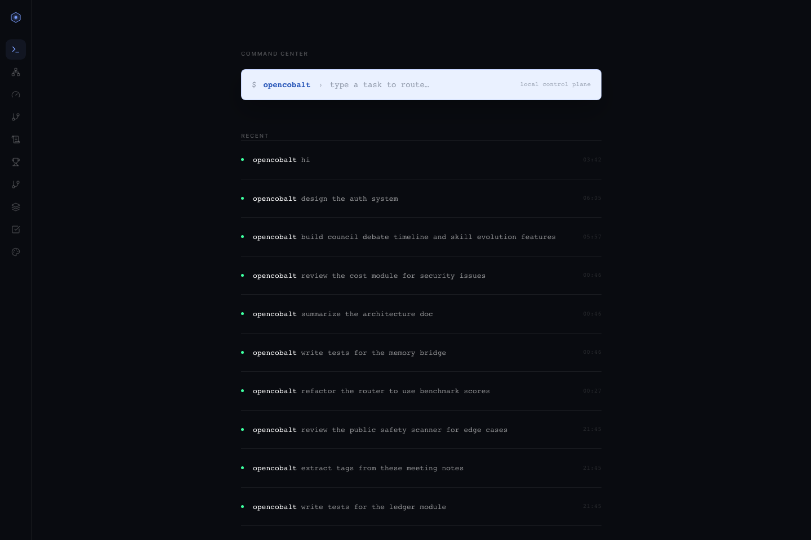
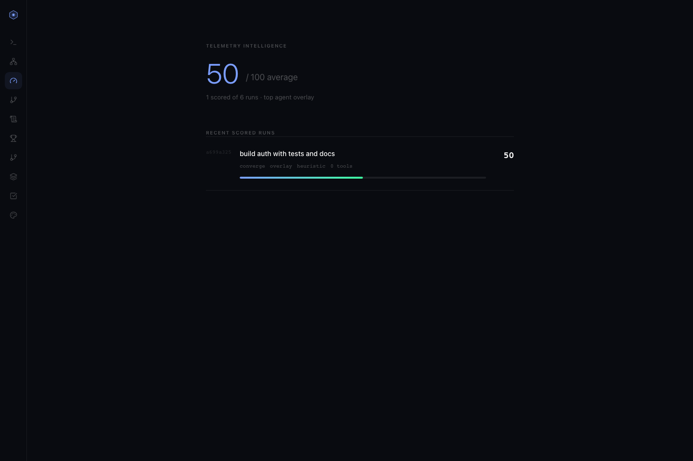
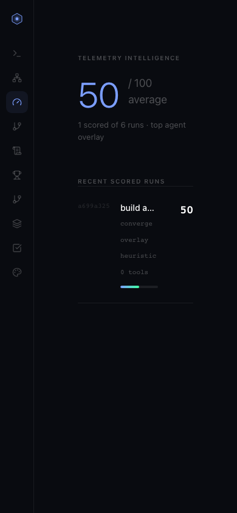
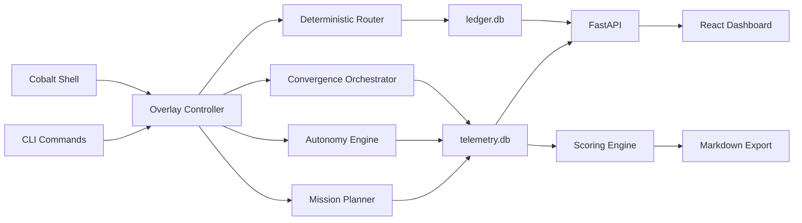

# OpenCobalt

[](https://github.com/moderqtor/OpenCobalt/actions/workflows/ci.yml)
[](https://www.python.org/)
[](LICENSE)

OpenCobalt is a local-first orchestration control plane for AI coding tools. It routes tasks to Claude Code, Codex CLI, Gemini CLI, Cursor, and Ollama with deterministic scoring, records decisions in SQLite, and exposes shell, CLI, dashboard, telemetry, and export workflows.

It is not a chatbot, hosted service, or API proxy. The default configuration makes no API calls. Ollama and external CLI tools are optional and degrade gracefully when unavailable.

## Screenshots







## What It Does

- Routes tasks deterministically with reproducible keyword scoring.
- Stores route decisions, session events, verification results, memories, and telemetry in local SQLite databases.
- Runs local shell workflows for routing, orchestration, convergence checks, autonomous task queues, mission planning, and context briefs.
- Scores completed runs across output quality, adherence, latency, token efficiency, tool fit, decomposition, agent selection, and convergence quality.
- Exports ledger and scored telemetry runs to markdown for project notes.
- Provides a React and FastAPI dashboard plus a Tauri desktop wrapper.

## Quickstart

```bash
git clone https://github.com/moderqtor/OpenCobalt
cd OpenCobalt
pip install -e ".[dev,server]"

opencobalt status
opencobalt route "review this module and write focused tests"
opencobalt
```

Ollama is optional. If it is installed, OpenCobalt can use it for worker-tier summarization and telemetry judging. Without Ollama, routing and telemetry fallback scoring still work locally.

## Core Commands

```bash
opencobalt route "design the auth module"       # deterministic tool routing
opencobalt history --limit 20                   # recent route decisions
opencobalt stats                                # ledger analytics
opencobalt verify                               # pytest plus public-check
opencobalt public-check                         # pre-push safety scan
opencobalt context                              # build a context pack
opencobalt brief                                # session brief for handoff
opencobalt ui                                   # dashboard at localhost:5173
opencobalt desktop                              # Tauri desktop wrapper
```

## Shell Workflow

Run `opencobalt` with no arguments to enter the interactive shell.

```text
opencobalt › /route design the auth module
opencobalt › /orch implement the API, tests, and docs
opencobalt › /converge build auth with tests and docs
opencobalt › /auto finish the dashboard polish --hours 2
opencobalt › /telemetry status
```

The shell keeps slash commands discoverable, routes plain prompts through the overlay controller, and shows session status in the prompt toolbar.

## Telemetry

Phase 15 adds a local intelligence layer in `.opencobalt/telemetry.db`.

```bash
opencobalt telemetry status
opencobalt telemetry runs --limit 20
opencobalt telemetry show <run_id>
opencobalt telemetry scores
opencobalt telemetry score <run_id>
opencobalt telemetry export --output ./telemetry-notes
opencobalt benchmark status --telemetry
```

Telemetry captures run type, prompt, agent, model, tool events, skills, connectors, artifacts, retries, latency, raw output, summary, and a ten-category score. Ollama judging is optional. If Ollama is unavailable or slow, OpenCobalt uses bounded heuristic fallback scoring.

## Architecture



SQLite is the source of truth:

- `.opencobalt/ledger.db` for sessions, route decisions, events, verification, costs, and benchmark records.
- `.opencobalt/memories.db` for bridge memory.
- `.opencobalt/observability.db` for observability sessions.
- `.opencobalt/telemetry.db` for scored run telemetry.

No Postgres, Redis, vector database, or background daemon is required for core state.

## Tool Tiers

| Tier | Tools | Typical work |
|---|---|---|
| executive | Claude Code, Gemini CLI, Antigravity CLI | Architecture, security review, final code, public docs |
| manager | Codex CLI, Cursor, Context7, GitHub CLI | Tests, lint, cleanup, UI work, PR and issue workflows |
| worker | Ollama, aider | Summaries, tags, extraction, local fallback |

Ollama is worker-tier only and optional.

## Dashboard

`opencobalt ui` starts:

- FastAPI backend on `localhost:8000`
- Vite dashboard on `localhost:5173`

The dashboard includes command routing, agents, telemetry scores, routing graph, ledger timeline, benchmarks, integrations, context pack, verification receipts, and DesignLab notes. Views are hash-linkable, for example `http://localhost:5173/#telemetry`.

## Verification

Current repository coverage includes 567 test functions across routing, ledger, memory, cost control, shell, telemetry, API, dashboard data, convergence, autonomy, and safety checks.

Common local checks:

```bash
python3 -m pytest -q
ruff check src/ tests/
npm run build --prefix ui
opencobalt public-check
opencobalt doctor
```

CI runs on GitHub Actions with Python 3.11.

## Project Layout

```text
src/opencobalt/
  cli.py                     Typer command surface
  shell.py                   interactive shell
  api_server.py              FastAPI dashboard backend
  core/
    router.py                deterministic routing
    ledger.py                SQLite ledger
    telemetry.py             run telemetry schema and session API
    scoring_engine.py        heuristic and judge-backed scoring
    ollama_judge.py          optional Ollama scoring adapter
    markdown_exporter.py     scored run markdown export
    convergence_orchestrator.py
    autonomy_engine.py
    mission.py
    public_safety.py
  agents/
  skills/
  integrations/
ui/
  src/App.jsx                React dashboard
  src/RoutingGraph.jsx       routing visualization
  src-tauri/                 desktop wrapper
tests/
docs/
```

## Safety Model

- No API calls by default.
- No required cloud database or hosted service.
- No 24/7 daemon for core workflows.
- Public safety scan checks for `.env` files, secret patterns, private path references, and oversized artifacts.
- API adapters require explicit configuration with `opencobalt config set api_enabled true`.

## License

MIT. See [LICENSE](LICENSE).
