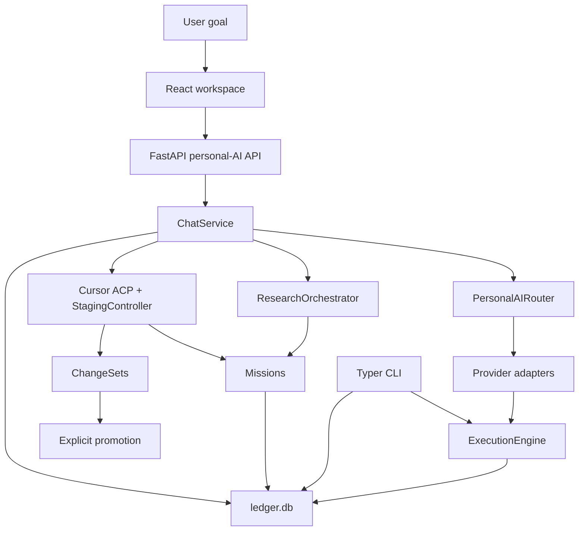

# Architecture

Current architecture only. Planned or speculative work belongs in
[ROADMAP.md](ROADMAP.md). Implementation files under `src/opencobalt/` are
authoritative if this document drifts.

## Overview

OpenCobalt is a local control layer. The user-facing surface is a React
workspace backed by FastAPI. Durable state is SQLite. External providers
supply inference, research synthesis, or coding execution. OpenCobalt owns
routing, policy, Missions, evidence, approvals, staging, and receipts.



`opencobalt ui` starts the API on `localhost:8000` and Vite on
`localhost:5173`. Both stop when the command exits. `opencobalt desktop`
wraps the same UI in Tauri when Cargo/Tauri tooling is installed. The web UI
is canonical.

## Package layout

```
src/opencobalt/
  cli.py                 Typer CLI
  api_server.py          FastAPI entry
  personal_ai/           Chat, routing, providers, research, coding, store
    service.py           Chat lifecycle
    router.py            Capability-role routing
    providers.py         Provider registry and snapshots
    research.py          Research Missions
    coding.py            Coding Mission overlay
    cursor_acp.py        Cursor ACP runtime
    staging.py           Staged workspace, ChangeSet, promotion
    personas.py          Versioned personas
    store.py             Personal-AI SQLite tables
  execution/             ExecutionEngine, adapters, receipts
  core/                  Ledger, missions, approvals, autonomy, legacy CLI router
  integrations/          PATH/discovery integrations
ui/                      React workspace and optional Tauri wrapper
```

## Chat lifecycle

1. The user sends a message in a durable conversation.
2. `ChatService` classifies the request and asks `PersonalAIRouter` for a
   route over an immutable provider snapshot.
3. Research cognitive policies divert into `ResearchOrchestrator`.
4. Mutating repo work with an attached `project_path` becomes a coding
   Mission and, when eligible, Cursor ACP execution in a staged workspace.
5. Ordinary Chat is answer-only. Tool and skill execution is rejected at the
   API boundary.
6. Successful or failed execution is recorded as a route, optional receipt,
   and lifecycle events. There is no silent fallback.

Simple questions do not create Missions. Research and coding-agent work do.

## Capability routing

The Personal AI router selects a capability role, then scores eligible
provider/model candidates. See [routing.md](routing.md).

A separate legacy keyword router in `core/router.py` still serves CLI
`opencobalt route` and some execution defaults. Do not treat that tool-tier
table as the Chat architecture.

## Providers

| Provider | Chat | Research LLM roles | Coding |
|---|---|---|---|
| Ollama | Executes when loopback local-catalog evidence passes | Eligible | No |
| Google Antigravity | Executes through isolated print | Eligible | `coding_analysis` advertised; no staging path |
| Cursor ACP | Not answer-only Chat | No | `coding_analysis` and `coding_agent` |
| Mock | Development only | Eligible | No |
| Claude Code | Adapter exists; Chat fails closed without answer-only isolation | No | No |
| Codex CLI | Adapter exists; Chat fails closed without answer-only isolation | No | No |
| Gemini CLI | Discovery-only | No | No |

Installation, authentication, health, and execution support are separate
facts. Details: [PERSONAL_AI_ROUTER.md](PERSONAL_AI_ROUTER.md).

## Personas

Personas are versioned interaction policies and routing affinities. They are
not hidden-prompt replicas of ChatGPT, Claude, or Gemini. A native-family
persona running on a different provider family is recorded as an
approximation. See `src/opencobalt/personal_ai/personas.py`.

## Missions

A Mission is durable work that outlives a provider session. Research and
coding-agent flows create Missions. The CLI mission state machine also links
approvals, execution, receipts, and outcomes for longer supervised work.
See [MISSIONS.md](MISSIONS.md), [research.md](research.md), and
[coding.md](coding.md).

## Evidence and receipts

Research stores sources, evidence, citations, and disagreements in the
shared ledger. User document attachments live beside the ledger under
`.opencobalt/attachments/` and can become Research sources. Execution writes
work receipts with artifact hashes through `ExecutionEngine`. Receipt
integrity is not factual verification.

## Approvals and staging

Live Cursor ACP tool permissions map into the Approval Bridge. Coding-agent
file changes stay in a staged workspace until the user applies a ChangeSet.
Apply copies staged files into the authoritative repository after conflict
and path-policy checks.

## Security boundaries

Documented in [SECURITY.md](../SECURITY.md). Summary:

- Local SQLite state, no hosted sync
- Local-only is a hard routing constraint
- Providers keep their own credentials
- Coding containment is staged-repo separation, not OS sandboxing
- Skills are not executed by inspection

## CLI and other subsystems

The CLI remains a full control plane: routing, receipts, missions, auto
planning, opportunity engine, evolve, daily operator, telemetry, and
adapter inspection. Those subsystems are implemented. They are supporting
machinery around the workspace, not a second product identity.
