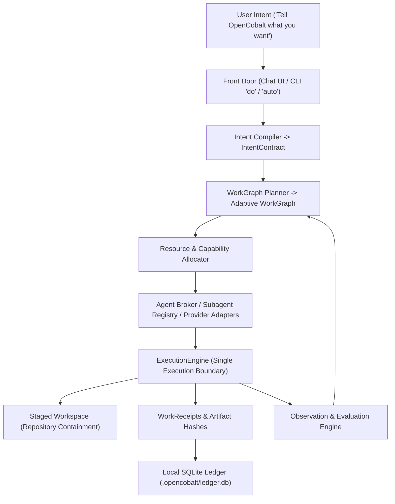

# Architecture

Current system architecture and near-term architectural direction.
Implementation files under `src/opencobalt/` are authoritative if this document drifts.

---

## 1. System Overview

OpenCobalt is a personal autonomous intelligence fabric. It translates human intent
into an adaptive program of work executed across available models, agents, tools, and runtimes.



The system operates across three conceptual layers:

1. **Autonomous Intelligence Layer**: Intent interpretation (`IntentContract`), adaptive `WorkGraph` planning, divergent ideation, multi-agent critique, and long-horizon supervisor replanning.
2. **Allocation & Brokering Layer**: Provider-neutral capability routing, agent broker, subagent registry, resource constraints (quotas, latency, cost, availability).
3. **Execution Substrate (The Kernel)**: Policy-gated execution (`ExecutionEngine`), repository staging containment (`StagingController`), approval lifecycle (`ApprovalBridge`), durable missions (`MissionStateMachine`), provenance (`WhyTrace`), and append-only SQLite storage (`.opencobalt/ledger.db`).

---

## 2. Package Layout

```
src/opencobalt/
  cli.py                 Typer CLI (interactive front door: do, auto, ui, missions, etc.)
  api_server.py          FastAPI server for local workspace
  creation/              Autonomous creation, IntentContract, WorkGraph, Supervisor
  agent_broker/          Multi-provider broker abstraction and Antigravity subagent backends
  personal_ai/           Chat, routing, providers, research, coding, store
    service.py           Chat lifecycle
    router.py            Capability-role routing
    providers.py         Provider registry and snapshots
    research.py          Research Missions
    coding.py            Coding Mission overlay
    cursor_acp.py        Cursor ACP runtime
    staging.py           Staged workspace, ChangeSet, promotion
    personas.py          Versioned personas
    store.py             Personal-AI SQLite tables
  execution/             ExecutionEngine, adapters, receipts
  core/                  Ledger, missions, approvals, autonomy envelopes, cognitive budgets
  integrations/          Discovery integrations
ui/                      React workspace and optional Tauri wrapper
```

---

## 3. Core Primitives

### A. IntentContract
Compiles raw human input into a structured specification distinguishing:
- `literal_request`: Exact user text.
- `hard_constraints`: Non-negotiable boundaries explicitly set by the user.
- `user_preferences`: Stated user inclinations.
- `inferred_objectives`: Goals deduced by OpenCobalt without confusing inference with explicit instruction.
- `open_dimensions`: Identified areas of creative freedom.
- `quality_criteria`: Evaluation benchmarks.
- `authority_boundary`: Maximum permissible autonomy/authority level.
- `budget`: Wall-clock, token, or iteration budget.

### B. WorkGraph
A directed acyclic or iterative graph representing work that needs to become true:
- Nodes represent tasks (e.g. `explore_concepts`, `attack_novelty`, `critique_fun`, `prototype_mechanic`, `implement_feature`, `evaluate_build`).
- Nodes never represent vendor calls directly (e.g. not "call Claude" or "run Gemini").
- Nodes declare required capabilities, input artifact dependencies, output artifact contracts, status, and evaluation criteria.

### C. Durable Supervisor Loop
Executes and monitors the `WorkGraph`:
```
observe state -> identify next work -> allocate capabilities -> execute bounded work -> ingest artifacts -> evaluate -> update graph -> continue
```

---

## 4. Capability Routing & Resource Allocation

OpenCobalt allocates work based on capability requirements and actual provider availability:
- **Capability Roles**: `cheap_local`, `fast_general`, `strong_reasoning`, `research`, `coding_analysis`, `coding_agent`.
- **Resource Constraints**: When providers are exhausted (e.g. Codex/Cursor out of quota), scheduler dynamically routes runnable work to available capable engines (e.g. Antigravity subagents or Ollama).

---

## 5. Execution Substrate & Safety

1. **Execution Boundary**: All external processes route through `ExecutionEngine`. CLI and orchestrators cannot bypass this gate.
2. **Repository Containment**: Coding mutations occur in isolated staging directories. Promotion to the authoritative repository requires explicit user action.
3. **Receipts & Provenance**: Every execution produces a `WorkReceipt` with input/output digests, artifact hashes, and provenance linkage in SQLite.
